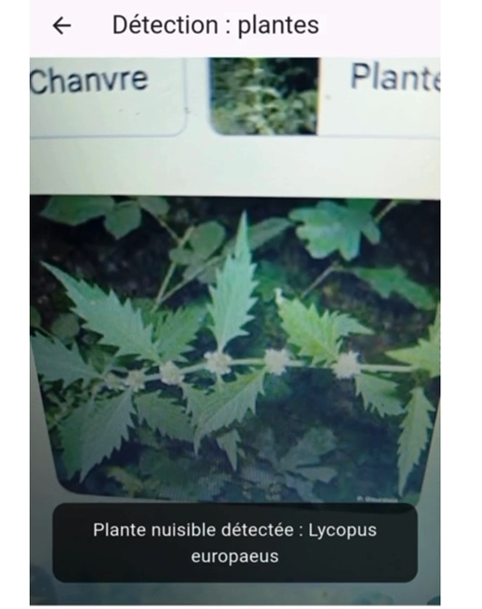
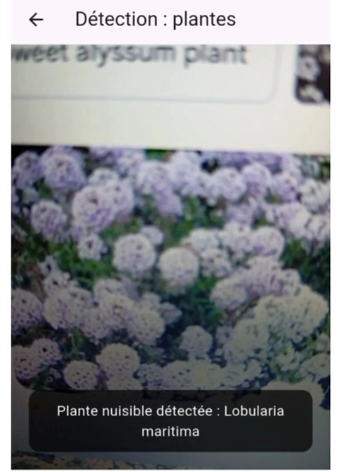

# 🐛 AgriScan – Détection Mobile des Plantes et Insectes Nuisibles par IA

**AgriScan** est une application mobile intelligente conçue pour aider les agriculteurs à **détecter rapidement les plantes nuisibles** (mauvaises herbes) et les **insectes nuisibles** qui menacent leurs cultures, grâce à la **vision par ordinateur** et à l’**intelligence artificielle**.

---

## Fonctionnalités principales :

### 🌿 Détection des plantes nuisibles
- Prenez une photo de la plante suspecte.
- L’application identifie automatiquement si elle est **nuisible**, et donne son **nom, niveau de danger**, et les **méthodes recommandées de traitement**.
- Exemples : chiendent, datura, morelle noire...

### 🐞 Détection des insectes nuisibles
- Scannez les insectes visibles sur les feuilles ou autour des cultures.
- Identification précise : insecte utile ou nuisible ? (ex : pucerons, chenilles, criquets...).
- Conseils de traitement bio ou chimique.

### 📊 Historique et géolocalisation
- Enregistre les détections par **lieu et date** pour le suivi.
- Permet de cartographier les foyers d’infestation.

---

## Aperçu de l'application

### Détection d'une plante nuisible – Exemple 1

### Détection d'une autre plante nuisible – Exemple 2

### Détection d'un insecte nuisible

---

## Objectif :
Lutter contre les nuisibles de manière **précoce**, efficace et durable, grâce à un **outil mobile accessible**, basé sur des technologies IA et une **base de données locale** des nuisibles les plus fréquents.

---

